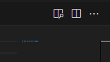
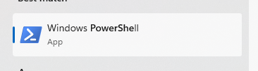
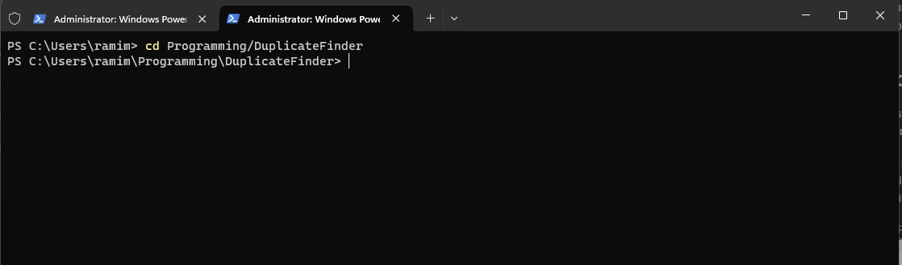
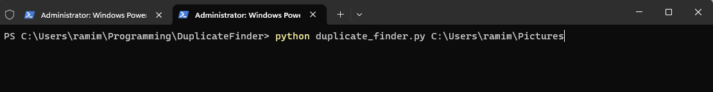
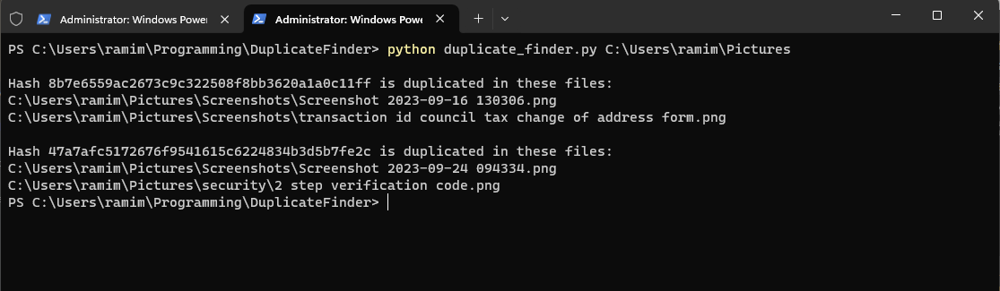

# MERRY CRIMBAS SISTER

## An introduction
### Okay, first off
If you're using Visual Studio Code, take a look in the upper right corner. There should be a little symbol with a magnifying glass, as shown below. Click on it and you should be able to view this file much more comfortably. 



### What the fuck is this?
I made a program for you that finds duplicate files! This took so much longer than I thought it would, which is kind of just how programming works, so it's not entirely finished. But it works! Mostly.

This README file is meant to show you how to use this program, and explain a little bit about what's going on. I'll work on it a bit more in future and push updates to github. I'll show you how to pull those changes to your local machine, but for now this little zipfile will have to do.

Some of the stuff in here is a little difficult to understand if you're new to Python, let alone if you're new to programming. I fucking struggled, I can tell you that. For now, I'll give you an overview. Feel free to copy tis folder, paste it somewhere else, and mess around with it!

## How do I use this nerd shit?

Good question! You already have Python installed on your computer, so that's the first step taken care of. What's next?

In order to use this program, you're going to have to get a little bit of familiarity with the windows command line, also called the terminal. Be aware, I'm using Windows 11 so the screenshots included may be a little different than what you see, but the things you type will be the same.

1. type "Powershell" into your start menu and click on the app that shows up. It looks like this:

2. When you open Powershell, it should give you a blank window with a blinking cursor next to a path that says something like ```C:\\Users\\TungoTheHorseGirl```
3. Navigate to the folder you extracted the zip file to. You can do this by typing ```cd <WHEREVER_YOU_SAVED_THIS_STUFF>```. Take a look below for an example

   1. A simpler way of doing this is to open file explorer in the folder you extracted the zip to, right click in the white space and click the option that says something like "open in terminal"
4. Type ```python find_duplicates.py <FOLDER YOU WANT TO FIND DUPLICATES IN>```

   1. Remember, this has to be the *full path* to the folder, including all the ```C:\\Users\\...``` stuff. It won't work with just the name of the folder.
5. Press enter. That's it, you've done it. If it doesn't work, then that's on me. It should give you an output something like this:


### Some things to note

* I highly recommend that you use this on specific folders and not on your ```Users``` folder, or any folder with a large amount of files in it. It increases the likelihood of the script erroring out because of an oversight on my part, and will likely take a while, too. Which leads onto...
* This is very much a work in progress! There will deffo be bugs (I've already run into one baffling one but it's almost 2am on Christmas day and I had to hide what I was doing while you showed me your pretty boy Zelda stuff from Jasmine, so I'm out of time). If you run into one, screenshot the response and send it to me please!
* You might need to wait a little while to get some results, especially if the files you're searching through are large.
* If there are no duplicate files in the folder you're searching in, you simply won't get anything printed to the terminal.

## So, uhh, what's it actually doing?
The first question to ask is, _how_ do we check that the contents of two file are the same?

We can do something called hashing. Essentially, this runs the contents of our file through an algorithm and produces what's called a "cryptographic hash". These are the long strings of letters and numbers you can see in the results screenshot. When two files have the exact same contents, they'll have the exact same hash.

What I've done in this script is to collect the paths of each file with the same hash into a list and display that to you in a user-friendly(ish) way.

If you'd like, we can step through this stuff together and I'll explain it to you! I really wanted to explain everything in detail through comments and in this readme, but I don't have the time now! If you're interested in looking into it, though, I suggest you start with FileHasher.py. This is the most well-written module in this folder and is easier to read than the others, in my opinion. 

One thing to note is that I've made FileHasher.py into a class, a facet of something we call object oriented programming. This was originally to show you how classes work and to contrast with find_duplicate_hashes.py, which is not written as a class, but time makes fools of us all. It doesn't matter too much, though. Do a little googling, give me some questions, and you should be able to get it.


## I hope you like it! 
There's no pressure to read the code and try to figure it out, but I figured if you're interested it might be worth giving you something useful which you can pick apart if you want. You can even try to improve it! Love you sis :) 
